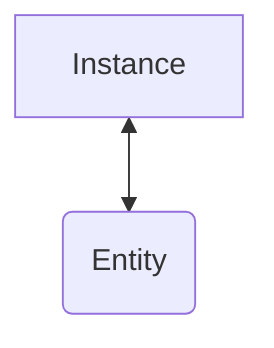
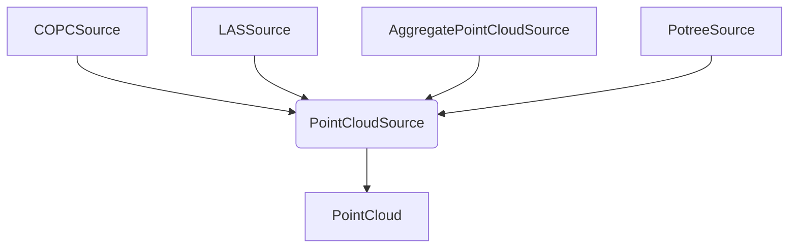
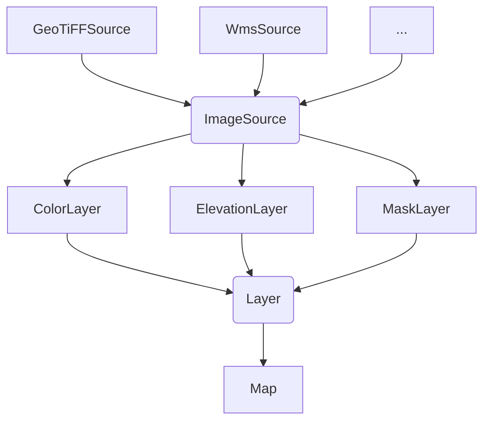

# Architecture

This document describes the high-level architecture of Giro3D.

## General flow

The entry point of Giro3D is the `Instance`. It contains the state of the Giro3D scene, and renders to the output canvas to be displayed to the user.

It is also a **collection of entities**. Entities are responsible for displaying geospatial data in a dynamic way.

Here is a rough mapping of concepts betwen Giro3D and various libraries.

| Giro3D   | OpenLayers                                                                        | Cesium                                                                |
| -------- | --------------------------------------------------------------------------------- | --------------------------------------------------------------------- |
| Instance | [Map](https://openlayers.org/en/latest/apidoc/module-ol_Map-Map.html)             | [Scene](https://cesium.com/learn/cesiumjs/ref-doc/Scene.html)         |
| Entity   | [Layer](https://openlayers.org/en/latest/apidoc/module-ol_layer_Layer-Layer.html) | [Primitive](https://cesium.com/learn/cesiumjs/ref-doc/Primitive.html) |

## Entities

Entities represent **dynamically updated renderable things**. For example, a terrain that is updated continuously depending on the camera's field of view is a typical entity. A point cloud as well.

> [!Note]
> Static objects, such as non-dynamic 3D models (for example the model of a tree) do not need to be encapsulated into entities and can be directly added to the scene as `Object3D`s.

Each entity is responsible for loading its data and display it on the screen during events in the update loop.

## The update loop

Every time the user moves the view, the instance triggers a new cycle of the update loop. During this cycle, the instance will ask each entity to update themselves so that their state matches the view (for example to load data in newly visible areas).

When all relevant objects are updated, the instance will trigger a new render to the canvas so that the 3D view is up-to-date.

## Loading data

As mentioned above, each entity is responsible for loading its own data. However, to avoid duplication of code when several data formats are available for the same representation (for example point clouds can come from various different file formats), we **separate the entity from the data source**.

Here is an example with the `PointCloud` entity.

We can see that the entity _pulls_ point cloud data from its source through the `PointCloudSource` interface.

**Invariant:** the sources never depend from the thing that consumes data from it.

> [!Note]
> Although not mandatory, we recommend to avoid caching data in data source. Caching generally occurs at the entity level. This keeps data source simple and reduce code duplication.

### Going further with the Map

The Map is an interesting case because it is the most complex entity currently in Giro3D. To manage complexity of rendering a 3D map with terrain and unlimited color layers, we go further and separate the entity, the _layers_ and the data sources.

#### Layers

Layers are sub-components of the `Map` entity. They are responsible for generating textures (one for each map tile) to paint on top of the map.

Each layer pulls images from its `ImageSource`, combines those image (for example in the case of tiled image source, we have to recombine the individual tiles to generate the requested texture).

**Invariant:** layers do not care about the exact type of their `ImageSource`. Everything flows through this interface.

> [!Note]
> Layers are not reserved to maps. They can be used elsewhere as they do not depend on a particular entity type. For example, point clouds can be painted with a `ColorLayer`.
