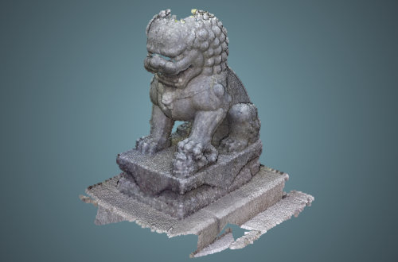
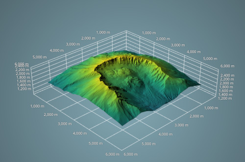
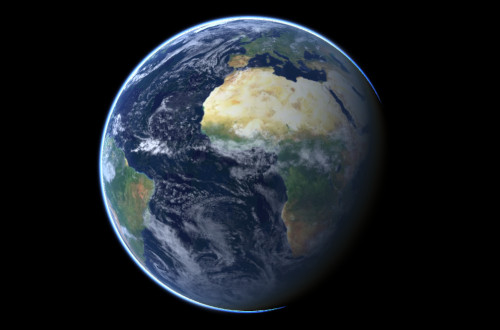

<div align="center">
  <a href="https://giro3d.org">
    
  </a>
</div>

<div align="center">
  A versatile framework to visualize geospatial data in the browser.
</div>

<br>

<div align="center">
  <a href="https://gitlab.com/giro3d/giro3d/badges/main/pipeline.svg"></a>
  <a href="https://gitlab.com/giro3d/giro3d/badges/main/coverage.svg"></a>
  <a href="https://www.npmjs.com/package/@giro3d/giro3d"></a>
  <a href="https://matrix.to/#/#giro3d:matrix.org"></a>
</div>

<br>

|         |  |  |
| ------------------------------------------------------ | ----------------------------------------------------------------- | ------------------------------------------------------------ |
|  |                     |                   |

<div align="center">
  <a href="https://giro3d.org/latest/examples/index.html">Examples</a> ·
  <a href="https://giro3d.org/latest/apidoc/index.html">Documentation</a> ·
  <a href="https://gitlab.com/giro3d/giro3d/-/blob/main/CHANGELOG.md">Changelog</a> ·
  <a href="https://giro3d.org/faq.html">FAQ</a>
</div>

## What is Giro3D ?

[**Giro3D**](https://giro3d.org) is a **Web library** written in TypeScript to build 2D and 3D geospatial scenes. It is powered by **[three.js](https://threejs.org)** and WebGL. It aims to **support major geospatial standards** and provide a rich feature set to help visualize data in a 3D environment.

> [!note]
> Giro3D is designed to integrate well in major UI frameworks such as React and Vue.

## Features

- 2D and 3D maps with **unlimited color layers**, real-time lighting and a broad range of data sources (tiled images, GeoTIFFs, static images, vector data, including Vector tiles).
- **High-resolution terrain rendering** with elevation querying / elevation profile
- Support of shadow maps on terrain
- Point clouds colored by **classification**, **colormaps** or **color layer**
- Create **shapes** and **annotations**, including height measurements and angular sectors.
- Easy to integrate with **GUI frameworks** such as Vue and React.
- Limit visibility of datasets using **cross-sections**
- Display 3D features with a **rich style API**

## Supported data sources

[Giro3D](https://giro3d.org) is powered by **[OpenLayers](https://openlayers.org/)** for maps,
and **[three.js](https://threejs.org)** for 3D assets, and can be easily extended to support more.

Below is a non-exhaustive list of supported data sources.

### Image data

- [WMTS](https://www.ogc.org/standards/wmts)
- [WMS](https://www.ogc.org/standards/wms)
- [TMS](https://www.ogc.org/standards/tms)
- [GeoTIFF](https://www.ogc.org/standard/geotiff/), with support for [Cloud Optimized GeoTIFFs (COG)](https://www.cogeo.org/)
- Static images

### Elevation data

- [DEM/DTM/DSM](https://gisgeography.com/dem-dsm-dtm-differences/) through [WMTS](https://www.ogc.org/standards/wmts)
- Elevation GeoTIFFs

### Vector data

- [Mapbox Vector Tiles](https://docs.mapbox.com/data/tilesets/guides/vector-tiles-introduction/)
- [GeoJSON](https://geojson.org/)
- [TopoJSON](https://github.com/topojson/topojson/)
- [KML](https://www.ogc.org/standard/kml/)
- [GPS Exchange Format (GPX)](https://en.wikipedia.org/wiki/GPS_Exchange_Format)

### Point clouds

- [Potree](https://github.com/potree/potree) datasets
    - Regular (bin file) point clouds
    - LAZ Potree point clouds
- [Cloud Optimized Point Clouds (COPC)](https://copc.io/)
- LAS/LAZ files
- 3D Tiles with `.pnts` tiles (you can generate them with [py3dtiles](https://py3dtiles.org/))

### 3D assets

- [3D Tiles](https://github.com/CesiumGS/3d-tiles) for optimized massive 3D datasets, including point clouds
- [glTF](https://github.com/KhronosGroup/glTF) for individual models

> [!note]
> You can also implement your own data sources, such as image sources or point cloud sources, as well as your own entities.

# Getting started

💡 To test Giro3D without installing anything, check the [interactive examples](https://giro3d.org/latest/examples/index.html).

## 🐋 Quick start with Docker

To run the examples locally without installing Node or NPM and without cloning the repository, you can use Docker to build and run an arbitrary branch of Giro3D:

```zsh
docker run --rm -p 8080:8080 $(docker build https://gitlab.com/giro3d/giro3d.git#<branch> -q)
```

Alternatively, a two-step method to see the Docker output:

```zsh
docker build -t giro3d:local https://gitlab.com/giro3d/giro3d.git#<branch>
```

```zsh
docker run --rm -p 8080:8080 giro3d:local
```

Replace `<branch>` with the branch name, (e.g `main`).

Then open your browser on the following URL: <http://localhost:8080>.

> [!note]
> This procedure will not work on branches that do not contain a `Dockerfile`.

## Install from the NPM package

To install with [npm](https://www.npmjs.com/) (recommended method):

```bash
npm install --save @giro3d/giro3d
```

This package contains both original sources (under `src/`) and slightly processed sources (dead code elimination, inlining shader code...).

If you're using a module bundler (like [wepback](https://webpack.js.org/)) or plan on targeting recent enough browser, you can directly import it as such:

```js
import Instance from '@giro3d/giro3d/core/Instance.js';
```

You can also import the original, untranspiled sources, by adding `src` after `@giro3d/giro3d/` :

```js
import Instance from '@giro3d/giro3d/src/core/Instance.js';
```

This will probably limit browser compatibility though, without application specific process or loader. Also, non `.js` files (such as `.glsl` files) will need to be inlined at client application level.

## From a release bundle

See our [release page](https://gitlab.com/giro3d/giro3d/-/releases).

## Tests

To run the test suite:

```bash
npm test
```

## API documentation and examples

Browse the [API Documentation](http://giro3d.org/apidoc/index.html) documentation or check the [examples](http://giro3d.org/examples/index.html).

### Running examples locally

The examples are the main way to test and develop Giro3D.

To run the examples locally:

```bash
npm run start
```

Then open <localhost:8080> (or the port that was mentioned in the build log) to see the example page.

To run a single example, for example the `osm` example, set the EXAMPLE environment variable to the name of the example:

```bash
EXAMPLE=osm npm run start
```

> [!note]
> Any change in the source code (typescript or GLSL files) will automatically reload the example. Other changes, such as HTML or CSS require a manual refresh of the page.

## Contributors and sponsors

Giro3D has received contributions and sponsoring from people and organizations listed in [CONTRIBUTORS.md](CONTRIBUTORS.md).
If you are interested in contributing to Giro3D, please read [CONTRIBUTING.md](CONTRIBUTING.md).

## Support

Giro3D is the successor of [iTowns](https://www.itowns-project.org/), an original work from [IGN](https://www.ign.fr/institut/identity-card) and [MATIS research laboratory](https://www.ensg.eu/MATIS-laboratory).
It has been funded through various research programs involving the [French National Research Agency](https://anr.fr/en/), [Cap Digital](https://www.capdigital.com/en/), [The Sorbonne University](https://www.sorbonne-universite.fr/en), [Mines ParisTech](https://mines-paristech.eu/), [CNRS](https://www.cnrs.fr/en), [IFSTTAR](https://www.ifsttar.fr/en), [Région Auvergne-Rhône-Alpes](https://www.auvergnerhonealpes.fr/).

Giro3D is currently maintained by [Oslandia](http://www.oslandia.com).

## No code with Piero

In case you don't want to code your own application, you can also use [Piero](https://piero.giro3d.org), our sister project - also available on [GitLab](https://gitlab.com/giro3d/piero).

<div align="center">
  <a href="https://piero.giro3d.org">
    
  </a>
</div>

## FAQ

### Where does the name Giro3D come from ?

The name is a reference to the italian mathematician and inventor [Girolamo Cardano](https://en.wikipedia.org/wiki/Gerolamo_Cardano).
